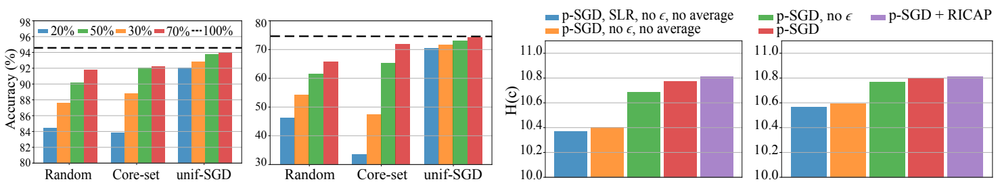

# How Important is Importance Sampling for Deep Budgeted training?

Official Pytorch implementation of our BMVC 2021 paper [*How Important is Importance Sampling for Deep Budgeted training?*](https://arxiv.org/abs/2110.14283)
<!-- Paper link: [arXiv](https://arxiv.org/abs/2110.14283) -->




## Experiments
### Arguments
The following command provides details on each of the arguments of the code:
``` sh
$ python train.py --h
```
The most relevant are the following:
* --budget: computational budget of the experiment (fraction of the iterations allowed per epoch)
* --method: approach to importance sampling (SGD, p-SGD, c-SGD, unif-SGD, or selective_backpropagation)
* --augmentation: data augmentation technique (standard, ricap, mixup, or randaugment)

### Datasets
The file [example_scripts.sh](https://github.com/EricArazo/ImportanceSampling/blob/master/example_scripts.sh) contain examples of how to run the experiments in each of the datasets and with different data augmentation techniques. All the datasets are automatically downloaded, except mini-ImageNet that has to be manually created and placed in the folder ```./data``` (follow this [link](https://github.com/gitabcworld/FewShotLearning/tree/master/utils) to download and create mini-ImageNet).

### Requirements
These are the most relevant dependencies to replicate our experiments:
* torch == 1.0.0
* numpy == 1.19.1
* torchvision == 0.2.1


## Acknowledgements

We would like to thank [1] [SelectiveBackprop](https://github.com/angelajiang/SelectiveBackprop) for the implementation of their approach to importance sampling "Selective Backpropagation" and [2] [RICAP](https://github.com/jackryo/ricap), [3] [mixup](https://github.com/facebookresearch/mixup-cifar10), and [4] [RandAugment](https://github.com/ildoonet/pytorch-randaugment) for the implementation of the data augmentation techniques used in our code.

[1] Angela H. Jiang, Daniel L.-K. Wong, Giulio Zhou, David G. Andersen, Jeffrey Dean, Gregory R. Ganger, Gauri Joshi, Michael Kaminksy, Michael Kozuch, Zachary C. Lipton, Padmanabhan Pillai, **"Accelerating Deep Learning by Focusing on the Biggest Losers"**, in *arXiv preprint arXiv:1910.00762*, 2019

[2] Ryo Takahashi, Takashi Matsubara, Kuniaki Uehara, **"RICAP: Data Augmentation using Random Image Cropping and Patching for Deep CNNs"**, in *IEEE Transactions on Circuits and Systems for Video Technology*, 2019

[3] Hongyi Zhang, Moustapha Cisse, Yann Dauphin, David Lopez-Paz, **"mixup: Beyond Empirical Risk Minimization"**, in the *International Conference on Representation Learning* (ICLR), 2018

[4] Ekin D. Cubuk, Barret Zoph, Jonathon Shlens, Quoc V. Le, **"RandAugment: Practical automated data augmentation with a reduced search space"**, in the *Conference on Vision andd Patern Recognition* (CVPR), 2020


## Please consider citing the paper if you find this work useful:

```
 @inproceedings{2021_BMVC_importanceSampling,
  title = {How Important is Importance Sampling for Deep Budgeted training?},
  author = {Eric Arazo and Diego Ortego and Paul Albert and Noel E O'Connor and Kevin McGuinness},
  booktitle={British Machine Vision Conference (BMVC)},
  year={2021},
 } 
```

<!-- Eric Arazo, Diego Ortego, Paul Albert, Noel E. O'Connor, and Kevin McGuinness, "How Important is Importance Sampling for Deep Budgeted training?", in The 32<sup>nd</sup> British Machine Vision Conference (BMVC), 2021 -->
